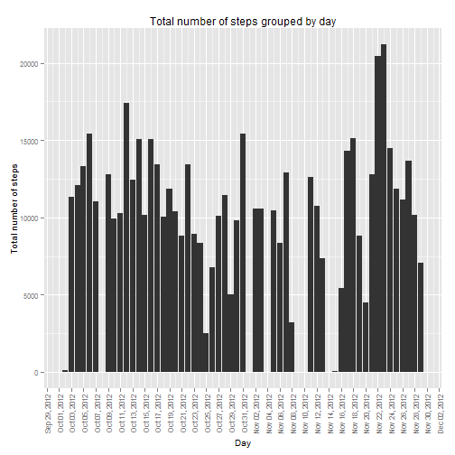
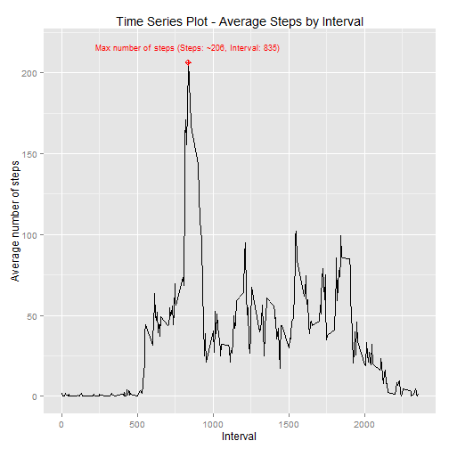
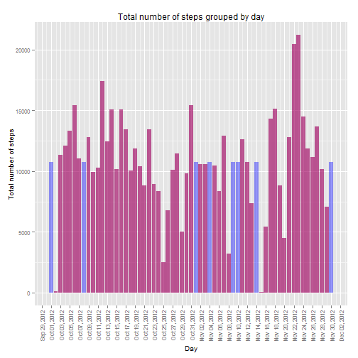
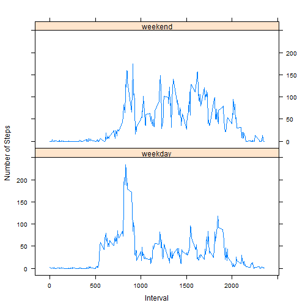

## Introduction

It is now possible to collect a large amount of data about personal movement using activity monitoring devices such as a Fitbit, Nike Fuelband, or Jawbone Up. These type of devices are part of the "quantified self" movement - a group of enthusiasts who take measurements about themselves regularly to improve their health, to find patterns in their behavior, or because they are tech geeks. But these data remain under-utilized both because the raw data are hard to obtain and there is a lack of statistical methods and software for processing and interpreting the data.

## Data
This assignment makes use of data from a personal activity monitoring device. This device collects data at 5 minute intervals through out the day. The data consists of two months of data from an anonymous individual collected during the months of October and November, 2012 and include the number of steps taken in 5 minute intervals each day.

The variables included in this dataset are:

- **steps**: Number of steps taking in a 5-minute interval (missing values are coded as NA)

- **date**: The date on which the measurement was taken in YYYY-MM-DD format

- **interval**: Identifier for the 5-minute interval in which measurement was taken

The dataset is stored in a comma-separated-value (CSV) file and there are a total of 17,568 observations.


The data for this assignment have been downloaded from the [course website][1] on Wed Jul 15 2015 at 00:10:18.


## Purpose of the assignment
The purpose of this assignment is to write a report that answers the questions detailed below:

- **Question 1**: What is mean total number of steps taken per day?

- **Question 2**: What is the average daily activity pattern?

- **Question 3**: Imputing missing values

- **Question 4**: Are there differences in activity patterns between weekdays and weekends?

[1]: https://d396qusza40orc.cloudfront.net/repdata%2Fdata%2Factivity.zip "course website"

## Assignment
### Loading and preprocessing the data
First of all, let's download, save and unzip the file containing the dataset with the measurements.

```r
url <- "https://d396qusza40orc.cloudfront.net/repdata%2Fdata%2Factivity.zip"
download.file(url = url, destfile='./activity.zip', method = "curl")
measurements.ds <- read.csv(unz("./activity.zip", "activity.csv"))
```

Convert the column "date" of the measurements.ds dataframe from factor to POSIXct, using the lubridate library

```r
library(lubridate)

measurements.ds$date <- ymd(measurements.ds$date)
```

### What is mean total number of steps taken per day?
Generate a histogram of the total number of steps taken each day. For this purpose, I use the ggplot2 library.

```r
library(plyr)
library(ggplot2)
library(scales)
#Summarize measurements grouped by date
matrix <- ddply(measurements.ds, c("date"), summarise, total_steps = sum(steps))
matrix$date <- as.Date(matrix$date)

ggplot(data = matrix, aes(x = date, y = total_steps)) +
      geom_histogram(stat = "identity") +
      ggtitle("Total number of steps grouped by day") +
      scale_y_continuous("Total number of steps") +
      scale_x_date("Day", labels=date_format("%b %d, %Y"), breaks = date_breaks("2 day")) +
      theme(axis.text.x=element_text(angle=90,hjust=1,vjust=0.5), 
            text = element_text(size=10))
```

 

Calculate and report the **mean** of the total number of steps taken per day

```r
mean(matrix$total_steps, na.rm = TRUE)
```

```
## [1] 10766.19
```
Calculate and report the **median** of the total number of steps taken per day

```r
median(matrix$total_steps, na.rm = TRUE)
```

```
## [1] 10765
```

### What is the average daily activity pattern?
Generate a time series plot of the 5-minute interval (x-axis) and the average number of steps taken, averaged across all days (y-axis)

```r
#Summarize measurements grouped by interval
measurements.ds.by.interval <- aggregate(x = measurements.ds$steps, 
      by = list(measurements.ds$interval), FUN = mean ,na.rm=TRUE)
names(measurements.ds.by.interval) <- c("interval","steps")

max.number.steps <- measurements.ds.by.interval[measurements.ds.by.interval$steps == 
      max(measurements.ds.by.interval$steps),]

label.max.value = paste('Max number of steps (Steps: ~', round(max.number.steps$steps, 0), ', Interval: ', max.number.steps$interval, ')', sep = '')

ggplot(measurements.ds.by.interval, aes(interval,steps)) +
      scale_x_continuous("Interval") +
      scale_y_continuous("Average number of steps") +
      ggtitle("Time Series Plot - Average Steps by Interval") +
      geom_line() +
      geom_point(aes(x = max.number.steps$interval, y = max.number.steps$steps), size=3, colour="red", shape=10) +
      annotate("text", x = max.number.steps$interval, y = max.number.steps$steps + 10, label = label.max.value, size = 3, colour="red")
```

 

Display the 5-minute interval, on average across all the days in the dataset, that contains the maximum number of steps (as computed above)


```r
max.number.steps$interval
```

```
## [1] 835
```

### Imputing missing values
Calculate and report the total number of missing values in the dataset (i.e. the total number of rows with NAs)


```r
count(measurements.ds$steps[is.na(measurements.ds$steps)])$freq
```

```
## [1] 2304
```

Filling in all of the missing values in the dataset with the mean for that 5-minute interval. The results are stored in a new dataset that is equal to the original dataset but with the missing data filled in.

```r
measurements.ds.no.na <- measurements.ds

replacenavalue <- function(currentValue, meanValue) {
      if (is.na(currentValue)) {
            meanValue
      } else {
            currentValue
      }
}

measurements.ds.no.na$normalised.steps <- 
      mapply(replacenavalue, measurements.ds.no.na$steps, measurements.ds.by.interval$steps)
```
Make a histogram of the total number of steps taken each day  

```r
#Summarize measurements grouped by date
matrix.no.na <- ddply(measurements.ds.no.na, c("date"), summarise, total_steps = sum(normalised.steps))
matrix.no.na$date <- as.Date(matrix.no.na$date)

ggplot(data = matrix.no.na, aes(x = date, y = total_steps)) +
      geom_histogram(stat = "identity", fill = "blue", alpha = 0.4) +
      ggtitle("Total number of steps grouped by day") +
      scale_y_continuous("Total number of steps") +
      scale_x_date("Day", labels=date_format("%b %d, %Y"), breaks = date_breaks("2 day")) +
      theme(axis.text.x=element_text(angle=90,hjust=1,vjust=0.5), 
            text = element_text(size=10)) +
      geom_histogram(data = matrix, stat = "identity", fill = "red", alpha = 0.4)
```

 

Calculate and report the **mean** of the total number of steps taken per day (after imputing missing data)

```r
mean(matrix.no.na$total_steps, na.rm = TRUE)
```

```
## [1] 10766.19
```
Calculate and report the **median** of the total number of steps taken per day (after imputing missing data)

```r
median(matrix.no.na$total_steps, na.rm = TRUE)
```

```
## [1] 10766.19
```

When replacing the NA values with the mean for that 5-minute interval, the impact on the mean and median total number of steps taken per day is limited. 

### Are there differences in activity patterns between weekdays and weekends?
Create a new factor variable in the dataset with two levels -- "weekday" and "weekend" indicating whether a given date is a weekday or weekend day.


```r
is.weekday.weekend <- function(date) {
      if (weekdays(date) == "Sunday" || weekdays(date) == "Saturday") {
            factor("weekend")
      } else {
            factor("weekday")
      }
}
```

Make a panel plot containing a time series plot (i.e. type = "l") of the 5-minute interval (x-axis) and the average number of steps taken, averaged across all weekday days or weekend days (y-axis)


```r
measurements.ds.no.na$date.type <- mapply(is.weekday.weekend, measurements.ds.no.na$date)

measurements.ds.no.na.by.interval <- aggregate(x = measurements.ds.no.na$steps, 
      by = list(measurements.ds.no.na$interval, measurements.ds.no.na$date.type), FUN = mean ,na.rm=TRUE)
names(measurements.ds.no.na.by.interval) <- c("interval", "date.type", "steps")

library(lattice)
xyplot(steps~interval | date.type, data = measurements.ds.no.na.by.interval,
      type = 'l',
      xlab = 'Interval',
      ylab = 'Number of Steps',
      layout = c(1,2))
```

 

Conclusions about the plot above:  

- The monitored subject walks slightly more during weekdays  

- The monitored subject wakes up later over the weekend :)
